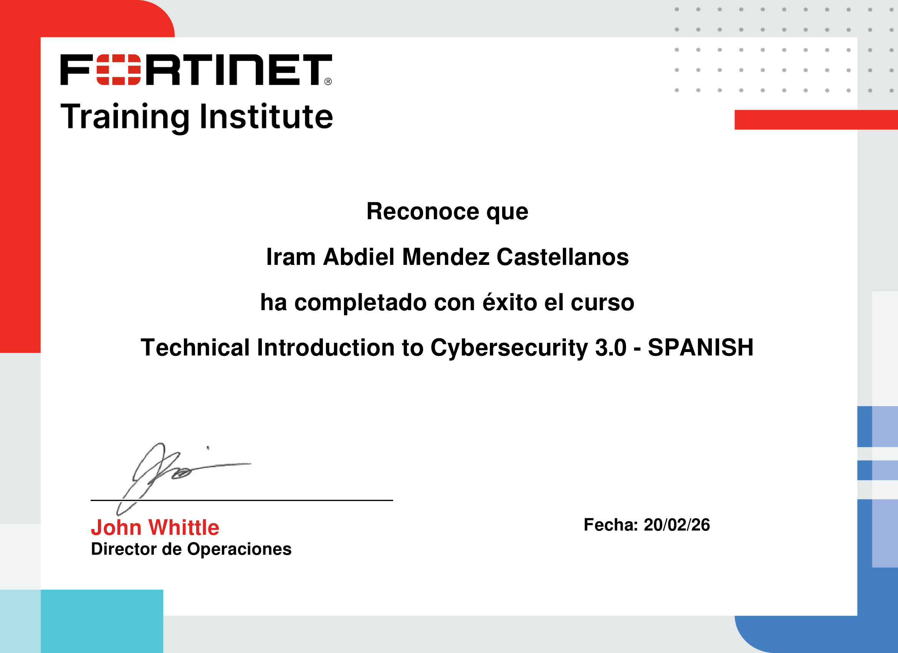
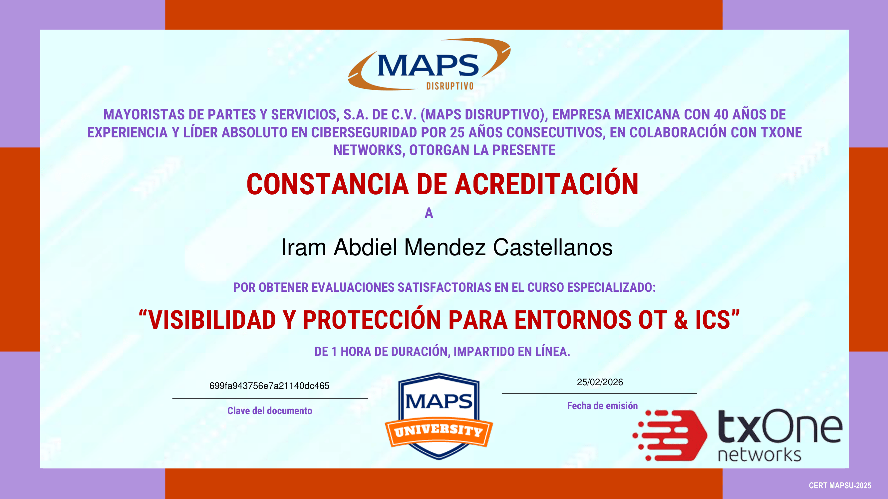
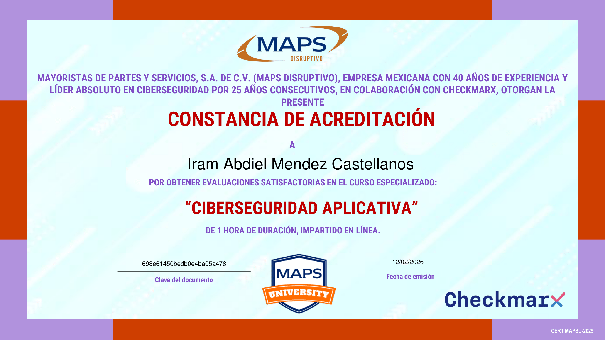
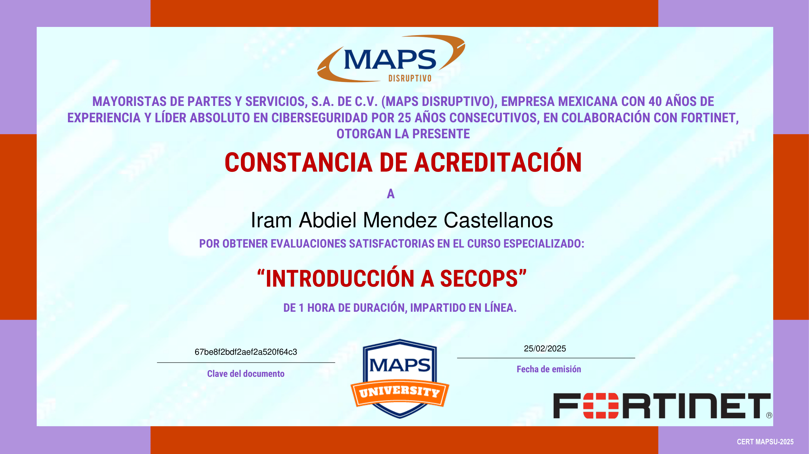

   

<h3 align="center">
  Hi, I'm Iram Abdiel Mendez Castellanos
</h3>

  

---

- 👨‍💻 I'm a Software Engineer passionate about building secure, efficient, and scalable systems.
- 🔒 Currently exploring Cybersecurity, focusing on secure software design and threat detection..
- 🔐 Learning more about Network Security, Penetration Testing, and Cryptography.

## 🛠 &nbsp;Tech Stack

#### 🔧 Languages

  

#### 🖥️ Frameworks and libraries

  

#### ⚡ db

  

#### 🔧 Tools

  

---
## 🛡️ Certifications

  
📜complementary cybersecurity certifications

   

 <table>
    <tr>
      <td></td>
      <td></td>
      <td></td>
    </tr>
    <tr>
      <td></td>
      <td></td>
      <td></td>
    </tr>
  </table>

  
📜complementary OT cybersecurity certifications 

   
 <table>
    <tr>
      <td></td>
    </tr>
  </table>

  ### 🔗 &nbsp;Contact Me

</a>

---

